# Jumper Exercise Tutorial
## 1. Inhoud
1. Inhoud
2. Inleiding
3. Benodigdheden
4. Unity Omgeving
5. Import ML-Agents
6. Componenten & Scripts
7. Learn de ML-Agent

## 2. Inleiding

Wij zijn 2 studenten van de AP Hogeschool die een Unity project hebben gemaakt waarbij een AI geleerd heeft over naderende obstakels te springen. 

| Student   |      email      |
|----------|:-------------:|
| Jonathan De Baerdemaeker |  s108835@ap.be |
| Luka Hendrickx |    s109055@ap.be   |

## 3. Benodigdheden

1. Unity Hub 2.4.1 (https://unity3d.com/get-unity/download)
2. Unity versie 2019.4.11f1 (https://unity3d.com/unity/whats-new/2019.4.11)
3. ML-agents release 6 package (https://github.com/Unity-Technologies/ml-agents)
4. Visual Studio Community  (https://visualstudio.microsoft.com/downloads/)
5. Python 3.8.6 (https://www.python.org/downloads/)

## 4. Unity Omgeving

### Project

We starten met het aanmaken van een nieuw Unity project met de Unity Hub die we geinstaleerd hebben. Je drukt op 'New' en selecteerd een 3D Project met een gepaste naam. Ten Slotte klik je op 'Create'.
 
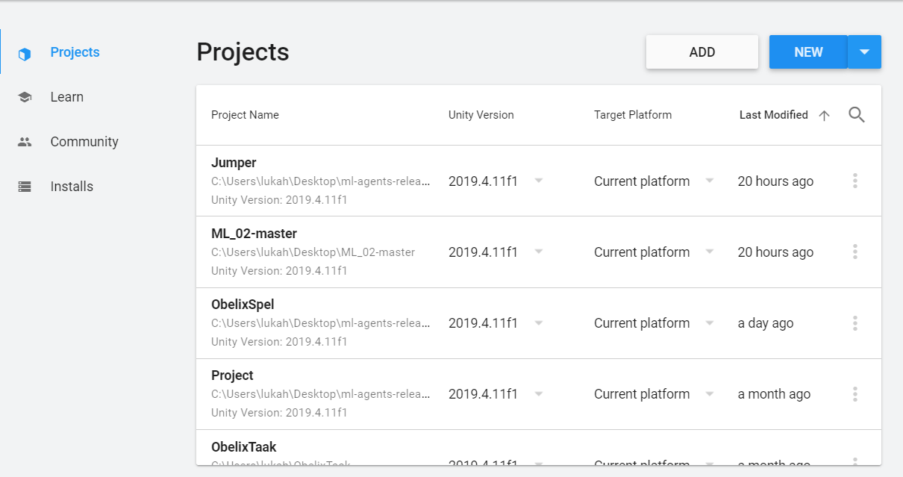
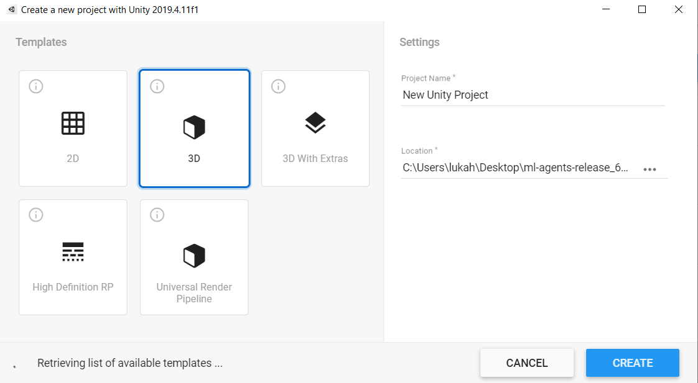

### Objecten

Maak nu de volgende Objecten aan in Unity zoals geillustreed op onderstaande afbeelding.


| Name   |      Soort Object      | Tag | 
|----------|:-------------:|:-------------:|
| Environment |  EmptyObject | environment |
| Cop |  3D GameObject Cube (Blue) | cop |
| Villain |    3D GameObject Cube (Red)  | villian |
| WallReward |    3D GameObject Cube (Transparent)  | wallreward |
| Road |    3D GameObject Panel  | road|
| WallTop |    3D GameObject Cube  | walltop |
| WallEnd |    3D GameObject Cube  | wallend |
| ScoreBoard |  3D GameObject TextMeshPro  | scoreboard |
| Spawnpoint |  EmptyObject | spawnpoint |
| Reset |  EmptyObject | reset |


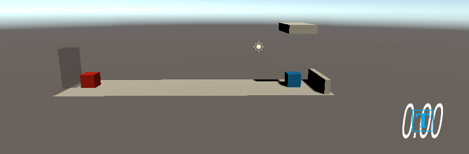

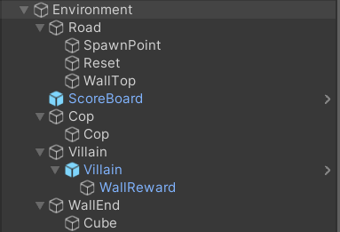

De __Environment__ bezit alle Objecten om het later makkelijker te maken deze omgeving te dupliceren. Duplicering zal later het leren of trainen van onze AI versnellen.

De __Spawnpoint__ bevindt zich in het Object __Villain__ zodat we later een script kunnen generen die meerdere __Villain__ Objecten op onze AI __Cop__ afstuurt.

De __Reset__ bevindt zich in het __Cop__ Object om onze AI netjes terug op zijn plek te zetten als hij botst met de __Villain__ of het __WallTop__ Object.

De __WallReward__ is gestructureerd in de __Villain__ zelf en dient om onze __Cop__ te belonen. 

De __WallEnd__ dient om het __Villain__ Object te vernietigen als hij hier tegen botst.

## 5. Import ML-Agents

In Unity klik je bovenaan op Window => Package Manager.

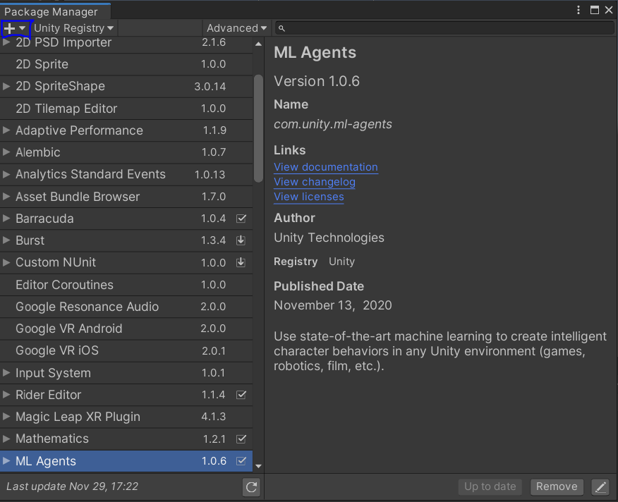

Hier klik je op '+' zoals hierboven geselecteerd en kies je voor 'Add package from disk'.

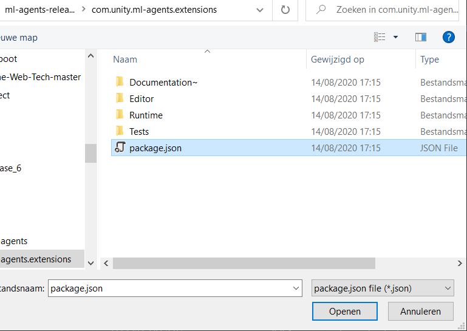

Selecteer de 'package.json' te vinden in je geinstalleerde folder van ML-Agents release 6. 

Hierna heb je succesvol ML-agents geimport in je project en kan je vervolgens bij andere projecten terug naar de PackageManager gaan om ML-agents opnieuw te importen.

## 6. Componenten & Scripts

Voeg volgende Componenten of Scripts toe aan de bijstaande objecten van onze omgeving. Een Component kan je zelf toevoegen door rechts onderaan 'Add Component' te klikken. Scripts zal je zelf moeten generen door simpel weg rechtermuisknop 'Create' => 'C# Script'. De Code van deze scripts zullen onderaan te vinden zijn.

| Object   |      Component      | Script | 
|----------|:-------------:|:-------------:|
| Environment |  / | Environment |
| Road |  / | Spawner |
| Cop |  Ray Perception Sensor 3D & Behaviour Parameters & RigidBody & Decision Requester  | Cop |
| Villain |  RigidBody  | Villain |

#### Environment

```csharp
using System.Collections;
using System.Collections.Generic;
using TMPro;
using UnityEngine;

public class Environment : MonoBehaviour
{
    public Cop cop;
    private TextMeshPro scoreBoard;
    public void OnEnable()
    {
        scoreBoard = transform.GetComponentInChildren<TextMeshPro>();
    }
    
    public void FixedUpdate()
    {
        scoreBoard.text = cop.GetCumulativeReward().ToString("f2");
    }
}
```

Dit script wordt gebruikt om de cumulative reward van onze __Cop__ bij te houden via ons __ScoreBoard__.

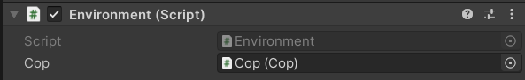

#### Cop

```csharp
using UnityEngine;
using Unity.MLAgents;
using Unity.MLAgents.Sensors;
using TMPro;

public class Cop : Agent
{
    public float force = 25f;
    private Rigidbody body = null;
    public Transform orig = null;
    
    public override void Initialize()
    {
        body = GetComponent<Rigidbody>();
        body.constraints = RigidbodyConstraints.FreezeRotation | RigidbodyConstraints.FreezePositionX | RigidbodyConstraints.FreezePositionZ;
    }
    public override void OnActionReceived(float[] vectorAction)
    {
        if (vectorAction[0] == 1)
        {
            Thrust();
        }
    }
    public override void OnEpisodeBegin()
    {
        ResetPlayer();
    }
    public override void Heuristic(float[] actionsOut)
    {
        actionsOut[0] = 0;
        if (Input.GetKey(KeyCode.UpArrow) == true)
        {
            actionsOut[0] = 1;
        }
    }
    private void ResetPlayer()
    {
        transform.position = new Vector3(orig.position.x, orig.position.y, orig.position.z);
    }

    private void Thrust()
    {
        body.AddForce(Vector3.up * force, ForceMode.Acceleration);
    }
    private void OnCollisionEnter(Collision collision)
    {
        if (collision.transform.CompareTag("villain") == true)
        {
            AddReward(-1f);
            Destroy(collision.gameObject);
            EndEpisode();
        }

        if (collision.transform.CompareTag("walltop"))
        {
            AddReward(-1f);
            EndEpisode();
        }
    }
    private void OnTriggerEnter(Collider other)
    {
        if (other.CompareTag("wallreward") == true)
        {
            AddReward(0.1f);
        }
    }
}
```

Dit is het Script van onze ML-Agent __Cop__. In de Initialize() declareren we onze RigidBody en geven we constraints mee die de volledige rotatie bevriest en ook de x- en z-positie van de __Cop__ bevriest. Vervolgens in de OnActionReceived() schrijven we de mogelijke acties van het object in dit geval Springen => Thrust() of niets doen. OnEpisodeBegin() zal onze __Cop__ terug op zijn juiste plek zetten => ResetPLayer(). Heuristic() is de methode die onze AI zal beheren om keuzes te maken tussen beslissingen in ons geval dus Springen of niets doen. Verder hebben we nog de OnCollisionEnter() methode, deze zorgt voor een negatieve cumulative reward als de __Cop__ een __Villain__ of __WallTop__ raakt. Ten slotte hebben we nog OnTriggerEnter() die een positieve cumulative reward geeft als de __Cop__ de __WallReward__ raakt die gepositioneerd is achter het __Villain__ Object.

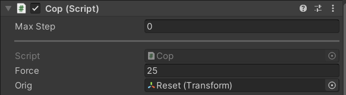

#### Villain

```csharp
using UnityEngine;

public class Villain : MonoBehaviour
{
    public float MoveSpeed = 3.5f;

    public void Update()
    {
        transform.Translate(Vector3.right * MoveSpeed * Time.deltaTime);
    }

    private void OnCollisionEnter(Collision collision)
    {
        if (collision.gameObject.CompareTag("wallend") == true)
        {
            Destroy(gameObject);
        }
    }
}
```

In dit script zien we een Update() methode die ervoor zorgt dat ons __Villain__ Object vooruit gaat. __Vector3.right__ kan verschillen afhankelijk van hoe je zelf jou __Villain__ gepositioneerd hebt. De OnCollisionEnter() maakt dat het __Villain__ Object wordt vernietigd als hij het __WallEnd__ Object raakt.

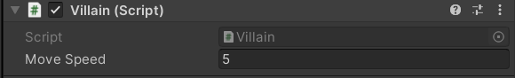

#### Spawner

```csharp
using UnityEngine;

public class Spawner : MonoBehaviour
{
    public GameObject prefab = null;
    public Transform spawnpoint = null;
    public float min = 1.0f;
    public float max = 3.5f;

    private void Start()
    {
        Invoke("Spawn", Random.Range(min, max));
    }
    
    private void Spawn(){
        GameObject go = Instantiate(prefab);
        go.transform.position = new Vector3(spawnpoint.position.x, spawnpoint.position.y, spawnpoint.position.z);
        Invoke("Spawn", Random.Range(min, max));
    }
}
```

Dit script zorgt voor een continue stroom van __Villain__ Objecten. We hebben ervoor gekozen om de objecten te laten spawnen in een random positie om het moeilijker te maken voor de __Cop__ doordat hij nu niet altijd op hetzelfde moment kant springen. Sommige __Villain__ Objecten zullen dus sneller of trager aankomen dan de vorige.

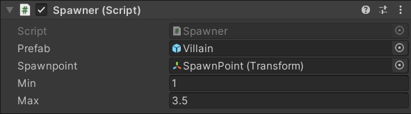

#### Ray Perception Sensor 3D (Cop)

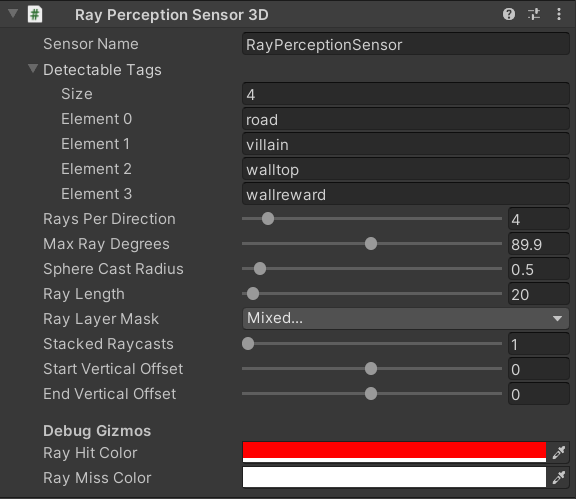


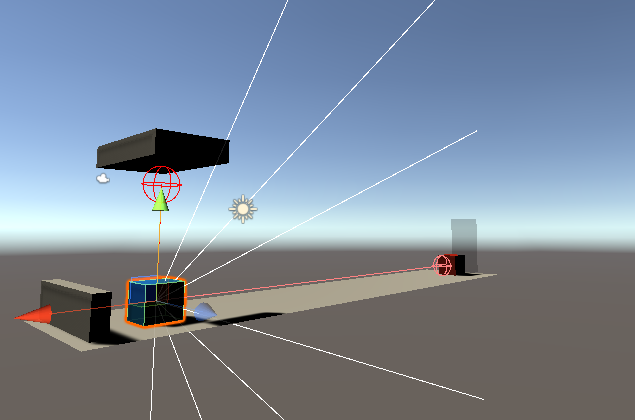

We hebben de rotatie van onze __Cop__ zelf gedraaid met 90 op de z-as om ervoor te zorgen dat hij ook de __WallTop__ kon waarnemen.

#### Behaviour Parameters (Cop)

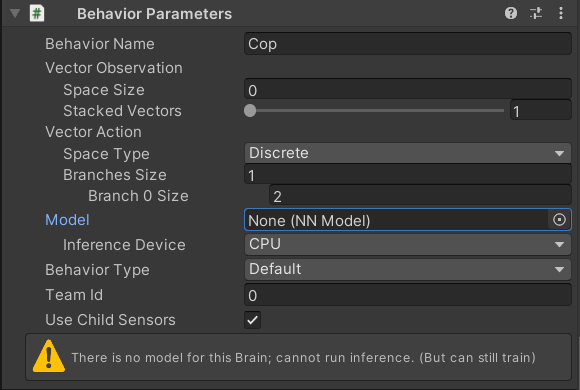

De Branches Size staat in ons geval op 1 omdat er 1 mogelijke actie is, springen. De Branch 0 Size staat voor de hoeveelheid keuzes die genomen kunnen worden bij deze actie namelijk niets doen of springen.

#### Decision Requester (Cop)

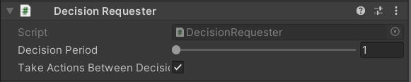

De Decision Period bepaalt hoe snel hij een keuze zal maken. In ons geval zal hij elke frame een keuze maken tussen niets doen of springen.

## 7. Learn de ML-Agent

Om een brein en configuratie te maken van de ML-Agent __Cop__ moeten we onze omgeving laten draaien in Unity. Koppieër je Omgeving 9 keer zodat het er als volgt uitziet. Door meerdere omgeving te creëren leert de __Cop__ sneller.

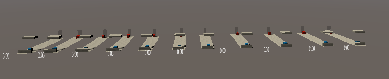

Nu kan je dit commando uitvoeren in je Command Prompt:

```
mlagents-learn
```
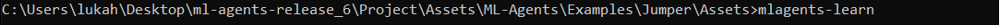

Nadat je dit commando hebt uitgevoerd moet je de Scene in Unity laten draaien door op 'Play' te drukken. Laat het draaien tot het stopt en ml-agents zal een nn.model aanmaken van je __Cop__ dit is het brein van de ML-Agent. Dit brein kan je verder gebruiken en trainen via tensorflow. Maar dit zien we in een volgende tutorial.

## Happy Coding! :)
